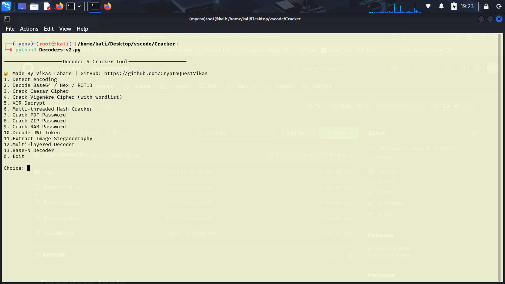

# Decoders-tools

# For which platform is it ?
> Windows </br>
> MacOs </br>
> Linux

# Requirements

```
pip install PyPDF2
pip install rarfile pyjwt stegano
sudo apt install unrar   # Required for RAR support on Linux
pip install rarfile pyjwt stegano
sudo apt install unrar
sudo apt install p7zip-full
pip install rarfile
pip install jwt
pip install stegano
```
# Install 
```
git clone https://github.com/CryptoQuestVikas/Decoders-tools.git
cd Decoders-tools
python3 Decoders-v1.py
python3 Decoders-v2.py
python3 Decoders-v3.py
```
# After Running script showing some options
```
--------------------Decoder & Cracker Tool--------------------

🔐 Made By Vikas Lahare | GitHub: https://github.com/CryptoQuestVikas
1. Detect encoding
2. Decode Base64 / Hex / ROT13
3. Crack Caesar Cipher
4. Crack Vigenère Cipher (with wordlist)
5. XOR Decrypt
6. Multi-threaded Hash Cracker
7. Crack PDF Password
8. Crack ZIP Password
9. Crack RAR Password
10.Decode JWT Token
11.Extract Image Steganography
12.Multi-layered Decoder
13.Base-N Decoder
14.Crack 7z Archive
15.Crack TAR.GZ Archive
0. Exit

Choice: 
```
# Screenshot



